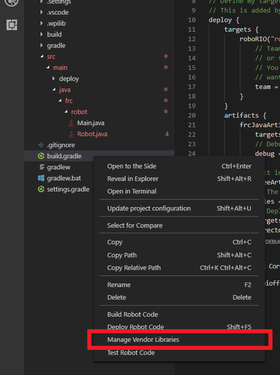
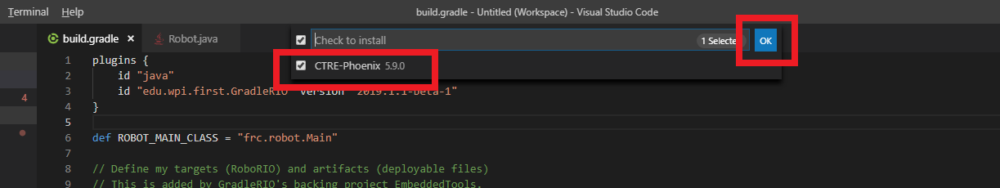

# basic-robot
> A step by step guide to creating a robot

This guide will be a start to finish guide with pictures of how to develop a basic drivetrain class.

+ If something is bolded, make sure you complete it before reading further
+ If something is quoted, it is additional information or a tip
## Step 0: Installing Libraries

+ Open FRC VSCode 202x (I am using 2020).
+ Go to the extensions tab, and make sure you have WPILib Installed and that it is up to date
+ Create a new repository on your personal github and clone it to the `workspace` folder
+ Make sure the repository includes your name, either the local copy or the github repository


## Step 1: Setting up `TimedRobot`

> This step is extremely well explained in [the docs](https://docs.wpilib.org/en/stable/docs/software/wpilib-overview/creating-robot-program.html).

**Follow the steps outlined in the [docs](https://docs.wpilib.org/en/stable/docs/software/wpilib-overview/creating-robot-program.html) with the configuration in the image below.**

When you get to the `New Project Creator Window`, Use `template`, `c++`, and `timed`. I choose the `Timed Skeleton (Advanced)` because it does not have anything to delete later.


Your code will now look like this after you reopen your *original folder*:


+ Select all the subfolders of `temporary-code` (or whatever you named the project) and drag them out.
    + *click the top one, hold shift then click the bottom one to select all*
+ Now you can delete the `temporary-code` folder.

> The main purpose of doing it this way is that wpilib will not let you create into an empty folder, **including `.git`**. This means that instead of a `git clone`, you would have to initialize a git repository from scratch, which [can be tricky](https://kbroman.org/github_tutorial/pages/init.html).

**Commit all the files to github**

> As a hint, remember you must first add all the files with `git add .`, then `git commit --message "my message"` and finally `git push`.

## Step 1.1: Install CTRE

For this tutorial, you will also need the CTRE Library from [here](http://www.ctr-electronics.com/hro.html#product_tabs_technical_resources). On the workstation computers this could already be installed. Then, Right-Click on "build.gradle" in the project tree and select "Manage Vendor Libraries".



Select "Install new libraries (offline)" and a menu will pop up with all the libraries you can install. Check CTRE Phoenix then OK.



## Step 2: File Structure


Does `Robot.cpp` and `Robot.h` look familiar? That's because it is a class!

Looking at the code for `Robot.h`, we can see

```c++
class Robot : public frc::TimedRobot {
```
> Our class inherits from the `TimedRobot` class, giving it functions that run at different points in time. As a team, we do not use `TestInit` or `TestPeriodic`.

```cpp
void RobotInit() override; // This is called once when the robot code initializes
void RobotPeriodic() override; // This is called every period (~50 times/sec) regardless of mode
void AutonomousInit() override; // This is called once when the robot first enters autonomous mode
void AutonomousPeriodic() override; // This is called every period (~50 times/sec) while the robot is in autonomous mode
void TeleopInit() override; // This is called once when the robot first enters teleoperated mode
void TeleopPeriodic() override; // This is called every period (~50 times/sec) while the robot is in teleoperated mode
```

Read more about the file structure of the project [here](files.md)

## Step 3a: Research - Already Written Code

Now that we have a template, we need to figure out what we want to do. In this example, we want to make a drivetrain connected to an xbox controller.

> This is one of the most time-consuming steps, is figuring out what classes and functions you will need to use and how to apply them!

Luckily, we have resources available! As we reuse the same motors (and sometimes even the same drivetrain design) as in the past, we can use that as a reference. Some examples to look at include:

+ [2020Robot](https://github.com/FRC830/2020Robot/tree/master/src/main)
+ [2019Robot](https://github.com/FRC830/2019Robot)
+ [WALL-O](https://github.com/FRC830/WALL-O)

In general, each part of the robot is located in 3 locations:
1. The **definition** is located in the header, which contains informations such as:
  + Class of Motor / Sensor
  + Pins it uses
  + Important constants that it may rely on
2. The **configuration** of these definitions
  + located in either `RobotInit` or sometimes in `TeleopInit` and `AutonomousInit`.
3. The main **logic** involving it
  + Is usually called repeatedly from `TeleopPeriodic` or `AutonomousPeriodic`.

> The only reason `RobotPeriodic` would be used is if we are logging a value in both `Teleoperated` and `Autonomous` mode

**Find the 3 sections of code of the drivetrain (definition, configuration, logic) in the [2020 Robot code](https://github.com/FRC830/2020Robot/tree/master/src/main)**

Answers:
+ The drivetrain definition is located [here](https://github.com/FRC830/2020Robot/blob/master/src/main/include/Robot.h#L112) (and uses numbers defined above in the header).
+ The configuration is located [here](https://github.com/FRC830/2020Robot/blob/master/src/main/cpp/Robot.cpp#L14).
+ The logic is located [here](https://github.com/FRC830/2020Robot/blob/master/src/main/cpp/Robot.cpp#L236).

## Step 3b: Research - Documentation


While previous projects allow us to see things we have already done, what happens if you need a new feature or are confused? This is where can look at the docs. Depending on the vendor, we might look at different documentation pages.

+ For 90% of our stuff, we can look at the core [WPILib Docs](https://first.wpi.edu/FRC/roborio/release/docs/cpp/).
+ For TalonSRX / FX and VictorSPX motors, we can look at [CTRE Docs](https://www.ctr-electronics.com/downloads/api/cpp/html/index.html)
+ For the Spark Max motor, we can look at the [Rev Robotics Docs](https://www.revrobotics.com/content/sw/max/sw-docs/cpp/index.html)

As an exercise, lets reverse engineer the `2019Robot` drivetrain located in the header [here](https://github.com/FRC830/2019Robot/blob/master/src/main/include/Robot.h).

```cpp
#pragma once

#include <Lib830.h>
#include <frc/WPILib.h>
#include <ctre/Phoenix.h>
	// Drivetrain declarations
class Robot : public frc::TimedRobot {
public:
    // ...

    // Drivetrain declarations
  	WPI_TalonSRX rightFront {RIGHT_FRONT_MOTOR_ID};
	WPI_TalonSRX leftFront {LEFT_FRONT_MOTOR_ID};
	WPI_VictorSPX rightBack {RIGHT_BACK_MOTOR_ID};
	WPI_VictorSPX leftBack {LEFT_BACK_MOTOR_ID};
	frc::DifferentialDrive drivetrain {leftFront, rightFront};
}
```

> In the code snippet I provided, we can see that we only use 2 of the 4 motors to create it! We will talk about this later.
> 
Lets start at the `WPI_TalonSRX` class. Lets first try the WPILib docs.


No dice :/

As I mentioned, the CTRE docs are where we can find `TalonSRX` and `VictorSPX` pages.


Now we can see all the methods on this motor.
> You may have noticed that this is not `WPI_TalonSRX` just `TalonSRX`. We will use the `WPI_TalonSRX` as it is compatible with WPILib classes such as `SpeedControllerGroup`.


> Some additional methods are inherited from `BaseTalon` and then `BaseMotorController`. This is a standard c++ inheritable pattern, as the TalonSRX just adds additional functionality to a basic motor. Some methods we can see here include `SetInverted` (not shown in the picture), which inverts a motor, and many more.
> 
We can click on the constructor to figure out what we need to setup the motor which turns out to be the CAN Device ID on our robot.


We will be using `Set(TalonSRXControlMode mode, double value)` later.

**On your own, pull up the documentation for the `VictorSPX` class**

**Find the documentation for the `XboxController`  and `DifferentialDrive` class.**


## Step 3c: Research - Reverse Engineering

Great! Now that you looked all of those up, and didn't skip ahead (because just reading won't help you - it's actually doing and following along) we can continue. Lets continue reverse engineering `2019Robot`.


#### ~~XboxController~~ GamepadF310
I wish 2019Robot had used `XboxController` for the sake of this tutorial, but alas we can see otherwise in the header:


```cpp
// Robot.h
class Robot : public frc::TimedRobot {
public:
    // ...
	// Controller declarations
	Lib830::GamepadF310 pilot {0};
	Lib830::GamepadF310 copilot {1};
    // ...
}
```

> 2020Robot and WALL-O use `XboxController` if you want to see it in action. This same reason is why I didn't use `2020Robot` to explain, as the motors are wrapped in a custom class.
> 
Sometimes, we create custom classes to add additional functionality. Past programmers made a custom library that we can use with a bunch of utility classes, including `GamepadF310`. The library is located [on GitHub here](https://github.com/FRC830/Lib830).

**Try finding the definition of the `GamepadF310` class by searching on github or just browsing around the repo.**

We can see it [here (.cpp)](https://github.com/FRC830/Lib830/blob/master/input/GamepadF310.cpp) and [here (.h)](https://github.com/FRC830/Lib830/blob/master/input/GamepadF310.h) if you couldn't find it.

This is just a replacement for XboxController, and if we want to see what functions it has, we can look at those two files (and the `Gamepad` class it inherits).

Why do we care so much about the controller? We can Control+F `pilot` in `Robot.cpp` to see everywhere we use the controller. It turns out we use a controller a lot when writing robot *control* code.


We also find [a function](https://github.com/FRC830/2019Robot/blob/master/src/main/cpp/Robot.cpp#L161) in there

```cpp
void Robot::handleDrivetrain() {
    // ...
}
```

interesting... we will return to this later.

### Configuration

All the configuration is done in `RobotInit` (for the drivetrain at least).

> This is usually a best practice, as not a lot of configuration happens that is specific to the `Teleop` or `Auton` modes.

```cpp
void Robot::RobotInit() {

    // Reset Motors
    rightFront.ConfigFactoryDefault();
    rightBack.ConfigFactoryDefault();
    leftFront.ConfigFactoryDefault();
    leftBack.ConfigFactoryDefault();

    // Set Victors to follow Talons
    rightBack.Follow(rightFront);
    leftBack.Follow(leftFront);

    rightFront.SetSensorPhase(false);
    leftFront.SetSensorPhase(false);

    rightFront.SetInverted(false);
    rightBack.SetInverted(false);
    leftFront.SetInverted(false);
    leftBack.SetInverted(false);
    // ...
}
```

**Lookup all 4 configurations functions we use in the documentation to gain a basic understanding of what they do.**

These are all important, but for this robot, these 2 lines are especially important:

```cpp
// Set Victors to follow Talons
rightBack.Follow(rightFront);
leftBack.Follow(leftFront);
```

If you remember back to the original snippet in the header, we were only using the front motors. The back ones wouldn't be moving at all.

```cpp
frc::DifferentialDrive drivetrain {leftFront, rightFront};
```

Now, we have all 4 motors involved, as the back motors 'mirror' the front two.

### The logic

This is the full handleDrivetrain function we have. Don't be overwhelmed, 90% we don't need to worry about.

```cpp
void Robot::handleDrivetrain() {
    //pilot controls were changed because of new controllers, was right x, LeftTrigger is really zaxis
    double turn = pilot.LeftTrigger();

    // Vision Autocorrect
    if (pilot.ButtonState(GamepadF310::BUTTON_X) && SmartDashboard::GetBoolean("Target Acquired", false)) {
        int visionMid = SmartDashboard::GetNumber("Vision Mid X", CAMERA_WIDTH/2);
        int targetX = CAMERA_WIDTH/2 - SmartDashboard::GetNumber("Vision Target Pixel Width", 0)*TARGET_WIDTH_TO_CAMERA_OFFSET_RATIO;
        turn = (visionMid - targetX)/ SmartDashboard::GetNumber("Vision Turn Factor", VISION_TURN_FACTOR);
    }
    
    //Center on cargo
    if (pilot.ButtonState(GamepadF310::BUTTON_B) && SmartDashboard::GetBoolean("Cargo Sighted",false)) {
        int cargoMid = SmartDashboard::GetNumber("Cargo Mid X", CAMERA_WIDTH/2);
        int targetX = CAMERA_WIDTH/2;
        turn = (cargoMid - targetX)/ SmartDashboard::GetNumber("Cargo Turn Factor", CARGO_TURN_FACTOR);
    }

    speed = Lib830::accel(prevSpeed, drivetrainDeadzone(pilot.LeftY()), TICKS_TO_ACCEL);
    prevSpeed = speed;

    // Some commented-out code
    // ...
    drivetrain.ArcadeDrive(speed, turn, true);

    SmartDashboard::PutNumber("Drivetrain Turn", turn);
    SmartDashboard::PutBoolean("High Gear State", gearState);
    SmartDashboard::PutNumber("Right X", pilot.RightX());
    SmartDashboard::PutNumber("Right Y", pilot.RightY());
    SmartDashboard::PutNumber("Left X", pilot.LeftX());
    SmartDashboard::PutNumber("Left Y", pilot.LeftY());
}
```

This is the first snippet that uses `SmartDashboard`. SmartDashboard is a logging class that we can use to store and write values for testing on `Shuffleboard`. We write and read from it throughout this function.

> We use Shuffleboard a lot throughout the season, just to make sure things are functioning correctly.

Lets trim this function down to what we need:

```cpp
void Robot::handleDrivetrain() {
    //pilot controls were changed because of new controllers, was right x, LeftTrigger is really zaxis
    double turn = pilot.LeftTrigger();
    speed = Lib830::accel(prevSpeed, drivetrainDeadzone(pilot.LeftY()), TICKS_TO_ACCEL);
    prevSpeed = speed;
    drivetrain.ArcadeDrive(speed, turn, true);
}
```

This code isn't the most straightforward but it can still be understood.
> Comments are important! Otherwise this code  might not make as much sense

+ First, we have a comment explaining that the turn variable isn't actually the `LeftTrigger`, it is a controller problem.
    + So really this is `double turn = pilot.LeftX()`
+ Then, we calculate the speed of the robot, and pass it into the `ArcadeDrive` function. The documentation for this is located [here](https://first.wpi.edu/FRC/roborio/release/docs/cpp/classfrc_1_1DifferentialDrive.html#a0a5fcea511631a24110afcee8f659633)


We pass in the speed as a function based on `accel` and `drivetrainDeadzone`.

The deadzone is pretty simple, it is just to prevent controller drift from moving the robot. `DRIVETRAIN_DEADZONE_THRESHOLD` is defined in the header.

```cpp
double Robot::drivetrainDeadzone(double value){
    if (std::fabs(value) < DRIVETRAIN_DEADZONE_THRESHOLD) {
        return 0;
    } 
    return value;
}
```

The accel function is just a non-linear function that stops the robot from accelerating too quickly. It is not crucial to understand how this works. We can see the algorithm [here](https://github.com/FRC830/Lib830/blob/master/util/Algorithms.cpp).

## Step 4

### You made it to the end of the reading (well kind of). Complete the task as outlined [here](drivetrain.md)