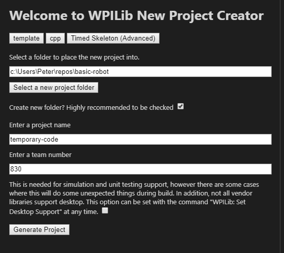

# basic-robot
> A step by step guide to creating a robot

This guide will be a start to finish guide with pictures of how to develop a basic drivetrain class.

## Step 0: Installing Libraries

+ Open VSCode 202x (I am using 2020).
+ Go to the extensions tab, and make sure you have WPILib Installed and that it is up to date
+ Create a new folder in the `workspace` folder to follow along


## Step 1: Setting up `TimedRobot`

> This step is extremely well explained in [the docs](https://docs.wpilib.org/en/stable/docs/software/wpilib-overview/creating-robot-program.html).

When you get to the `New Project Creator Window`, Use `template`, `c++`, and `timed`. I choose the `Timed Skeleton (Advanced)` because it does not have anything to delete later.



Your code will now look like this after you reopen your *original folder*:


> The main purpose of doing it this way is that wpilib will not let you create into an empty folder, **including `.git`**. This means that instead of a `git clone`, you would have to initialize a git repository from scratch, which [can be tricky](https://kbroman.org/github_tutorial/pages/init.html).

+ Select all the subfolders of `temporary-code` (or whatever you named the project) and drag them out.
    + *click the top one, hold shift then click the bottom one to select all*
+ Now you can delete the `temporary-code` folder.

## Step 2: File Structure


Does `Robot.cpp` and `Robot.h` look familiar? That's because it is a class!

Looking at the code for `Robot.h`, we can see

```c++
class Robot : public frc::TimedRobot {
```
> Our class inherits from the `TimedRobot` class, giving it functions that run at different points in time. As a team, we do not use `TestInit` or `TestPeriodic`.

```cpp
void RobotInit() override; // This is called once when the robot code initializes
void RobotPeriodic() override; // This is called every period regardless of mode
void AutonomousInit() override; // This is called once when the robot first enters autonomous mode
void AutonomousPeriodic() override; // This is called periodically while the robot is in autonomous mode
void TeleopInit() override; // This is called once when the robot first enters teleoperated mode
void TeleopPeriodic() override; // This is called periodically while the robot is in teleopreated mode
// void TestInit() override; // This is called once when the robot enters test mode
// void TestPeriodic() override; // This is called periodically while the robot is in test mode
```