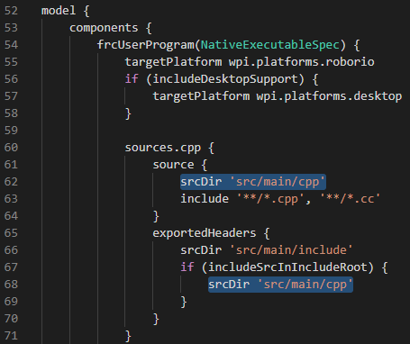

# File Structure


#### build.gradle
Outside of the `src` code folder, we can see the `build.gradle` file that is run when WPILIB builds a project. This is where we can modify what locations it should look for headers and complete cpp files.



For example, to look for more classes in `src/library` we can modify `source` to:

```c++
source {
    srcDir 'src/main/cpp'
    srcDir 'src/library'
    include '**/*.cpp', '**/*.cc'
}
```

#### deploy folder

All files in the deploy folder will be deployed onto the roborio. This is for static files / configuration files.

